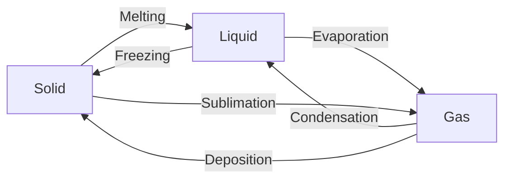
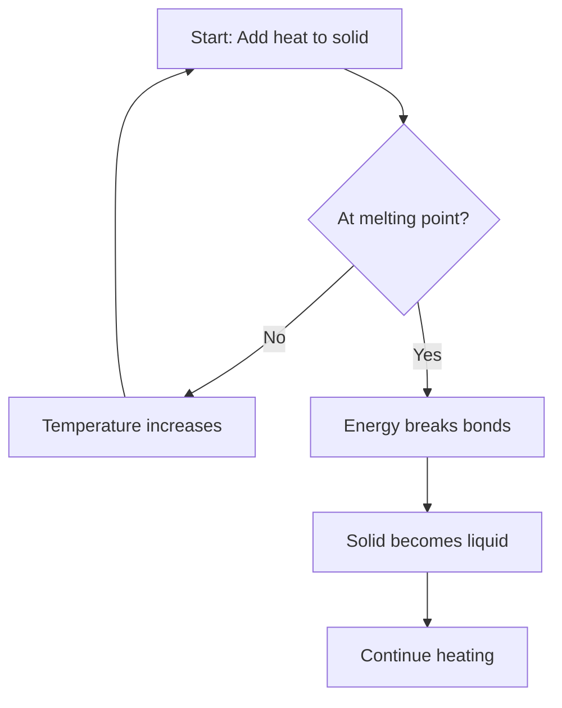
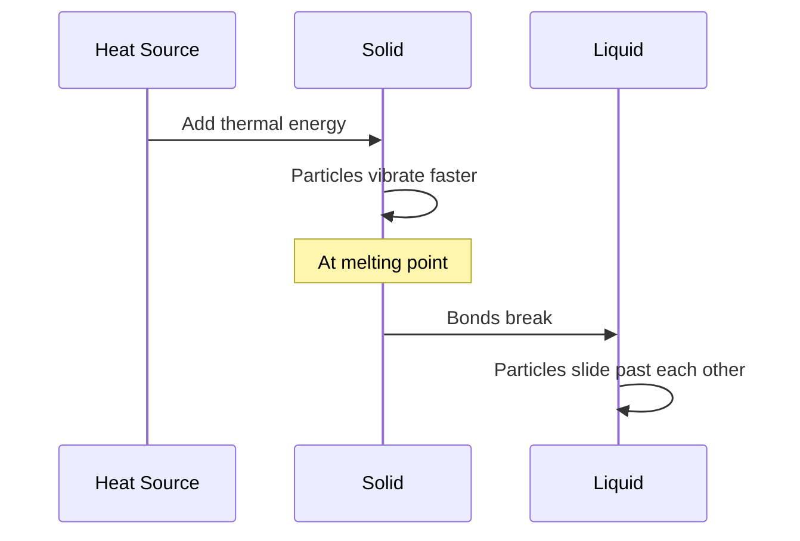
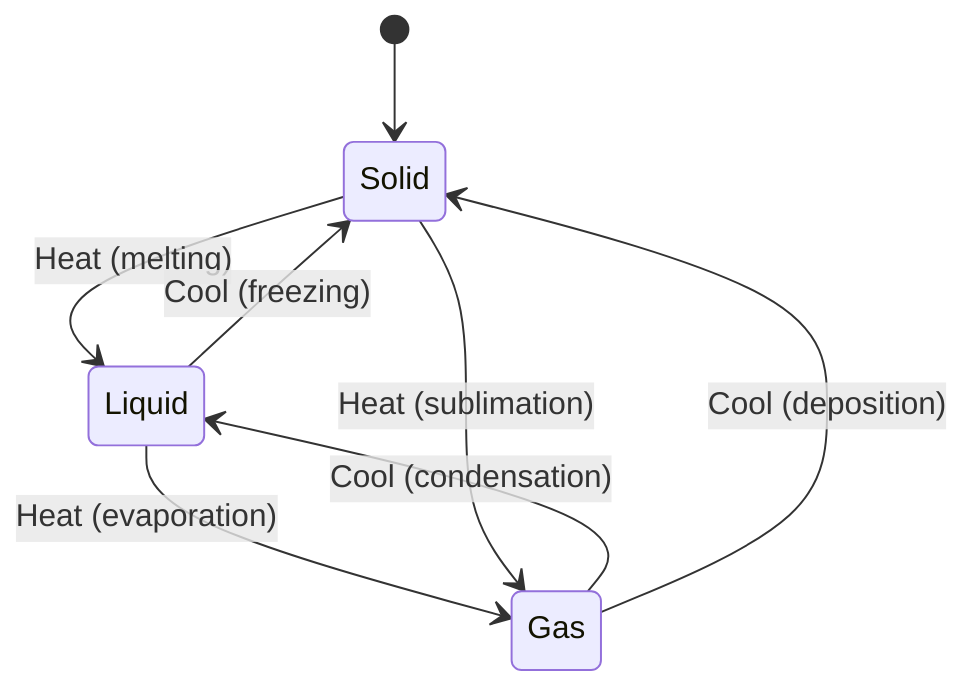
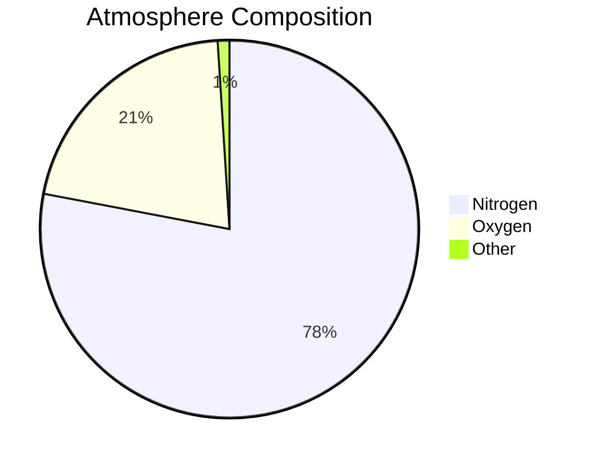
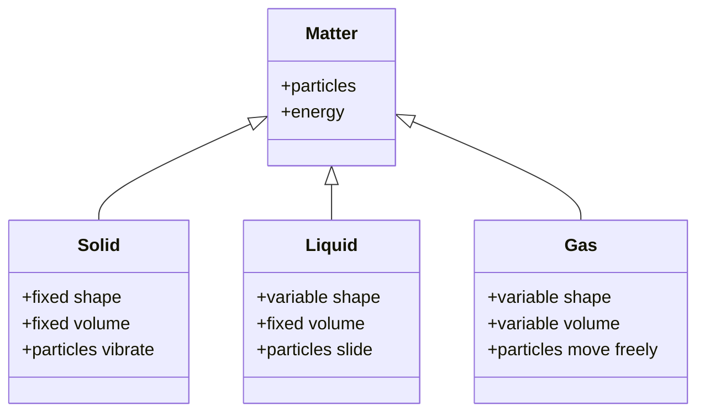
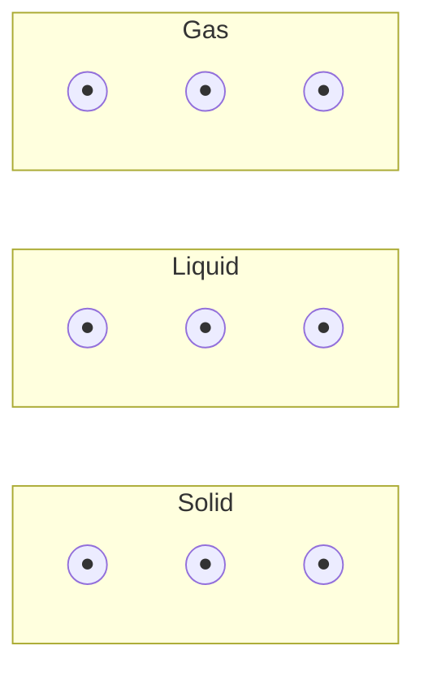

# Rich Content Formatting Guide

Complete guide to formatting educational content with equations, tables, diagrams, and code.

## Supported Content Types

| Type | Syntax | Rendered By |
|------|--------|-------------|
| Inline Math | `$E=mc^2$` | KaTeX |
| Block Math | `$$\frac{a}{b}$$` | KaTeX |
| Tables | GFM Markdown | react-markdown |
| Diagrams | ` ```mermaid ` | Mermaid.js |
| Code | ` ```language ` | Syntax highlight |
| Markdown | `**bold**`, `*italic*` | react-markdown |

---

## 1. Mathematical Equations (KaTeX)

### Inline Equations
Use single dollar signs for inline math:

```markdown
The formula $v = \frac{d}{t}$ calculates velocity.
Energy is given by $E = mc^2$ where $c$ is the speed of light.
```

### Block Equations
Use double dollar signs for centered block equations:

```markdown
The quadratic formula:

$$x = \frac{-b \pm \sqrt{b^2 - 4ac}}{2a}$$
```

### Common Science Equations

```markdown
# Physics
$$F = ma$$
$$KE = \frac{1}{2}mv^2$$
$$PE = mgh$$

# Chemistry (use \ce{} for chemical formulas)
$$\ce{2H2 + O2 -> 2H2O}$$
$$\ce{CO2 + H2O -> H2CO3}$$

# With units
$$v = 5 \text{ m/s}$$
$$T = 25°\text{C}$$
```

### Fractions, Powers, Roots

```markdown
$\frac{a}{b}$           # Fraction
$x^2$                   # Superscript/power
$x_1$                   # Subscript
$\sqrt{x}$              # Square root
$\sqrt[3]{x}$           # Cube root
$3 \times 10^8$         # Scientific notation
```

---

## 2. Tables (Markdown)

### Basic Table

```markdown
| State | Shape | Volume |
|-------|-------|--------|
| Solid | Fixed | Fixed |
| Liquid | Variable | Fixed |
| Gas | Variable | Variable |
```

### Aligned Columns

```markdown
| Property | Value | Unit |
|:---------|------:|:----:|
| Mass | 5.0 | kg |
| Volume | 2.5 | m³ |
| Density | 2.0 | kg/m³ |
```
- `:---` left align
- `---:` right align
- `:---:` center align

### Complex Data Table

```markdown
| Substance | Melting Point (°C) | Boiling Point (°C) | State at 25°C |
|-----------|-------------------:|-------------------:|:-------------:|
| Water | 0 | 100 | Liquid |
| Iron | 1538 | 2862 | Solid |
| Oxygen | -219 | -183 | Gas |
| Mercury | -39 | 357 | Liquid |
```

---

## 3. Mermaid Diagrams

### Flowchart (State Changes)

````markdown

````

### Flowchart (Decision Process)

````markdown

````

### Sequence Diagram (Process Steps)

````markdown

````

### State Diagram (Entity States)

````markdown

````

### Pie Chart (Distribution)

````markdown

````

### Class Diagram (Concepts)

````markdown

````

---

## 4. Code Blocks

### Generic Code

````markdown
```
Plain text or pseudocode
No syntax highlighting
```
````

### Language-Specific

````markdown
```python
# Calculate density
mass = 10  # kg
volume = 2  # m³
density = mass / volume
print(f"Density: {density} kg/m³")
```
````

````markdown
```javascript
// Energy calculation
const mass = 5; // kg
const velocity = 10; // m/s
const kineticEnergy = 0.5 * mass * velocity ** 2;
console.log(`KE = ${kineticEnergy} J`);
```
````

---

## 5. Combined Examples

### Question with Equation and Table

```markdown
A ball is dropped from different heights. Use the formula $PE = mgh$
where $g = 10 \text{ m/s}^2$ to complete the table:

| Height (m) | Mass (kg) | PE (J) |
|------------|-----------|--------|
| 5 | 2 | ? |
| 10 | 2 | ? |
| 15 | 2 | ? |

Show your working for one calculation.
```

### Question with Diagram and Explanation

````markdown
The diagram shows the particle arrangement in different states:



Explain why the particles in a gas are shown further apart than in a solid.
````

### Solution with Equation Steps

```markdown
**Solution:**

Using the kinetic energy formula:

$$KE = \frac{1}{2}mv^2$$

Substituting values ($m = 2$ kg, $v = 5$ m/s):

$$KE = \frac{1}{2} \times 2 \times 5^2$$

$$KE = \frac{1}{2} \times 2 \times 25$$

$$KE = 25 \text{ J}$$

The kinetic energy is **25 joules**.
```

---

## Validation Rules

### Equations
- All `$` must be paired
- All `{` must have matching `}`
- Use `\text{}` for units within equations
- Chemistry uses `\ce{}` for formulas

### Tables
- Header row required
- Separator row required (`|---|`)
- Column count must match

### Mermaid
- Must start with valid diagram type
- Node IDs must be unique
- Arrows must connect valid nodes
- Proper indentation for subgraphs

### Code Blocks
- Opening and closing backticks must match (```)
- Language identifier optional but recommended

---

## richContent Flags

When using rich content, set the appropriate flags:

```json
{
  "richContent": {
    "hasEquations": true,    // If using $...$ or $$...$$
    "hasTables": true,       // If using markdown tables
    "hasGraphs": false,      // If using data charts
    "hasDiagrams": true,     // If using ```mermaid blocks
    "hasCode": false         // If using other code blocks
  }
}
```

This helps the renderer optimize loading and the validator check syntax.
